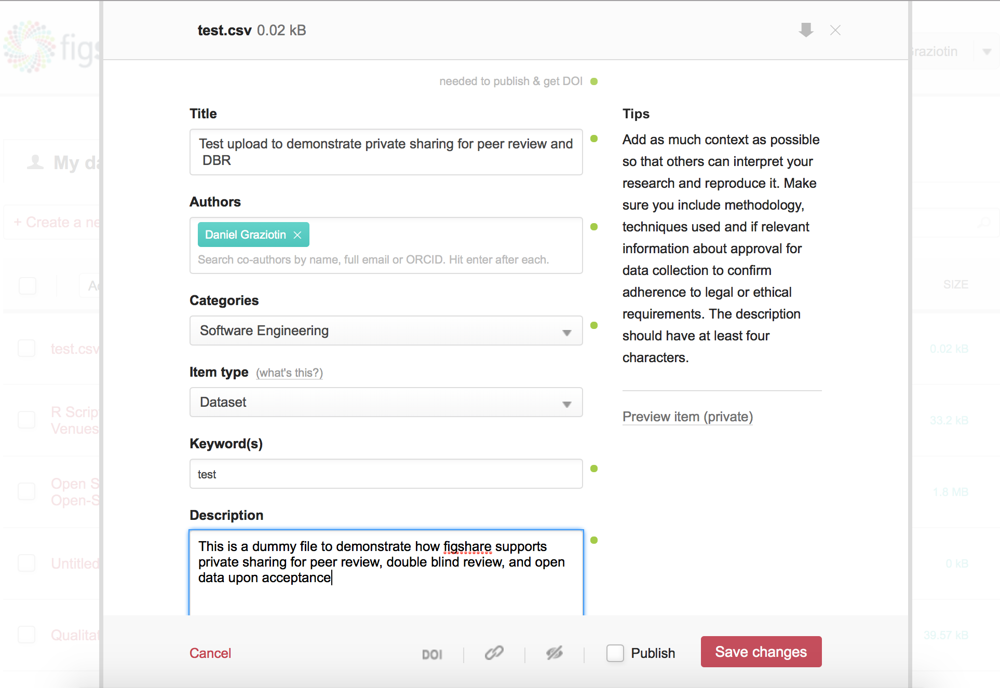
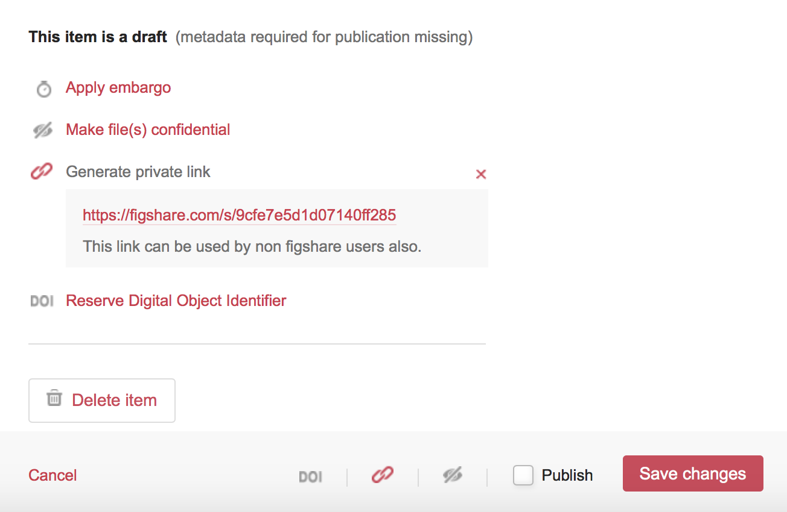
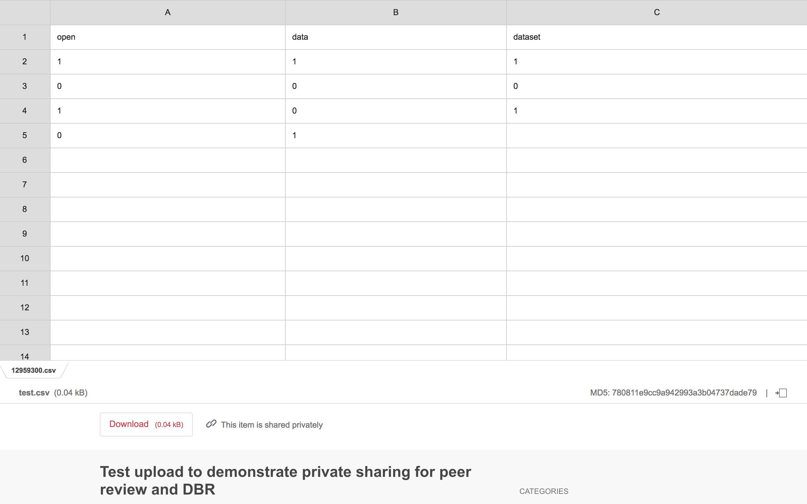
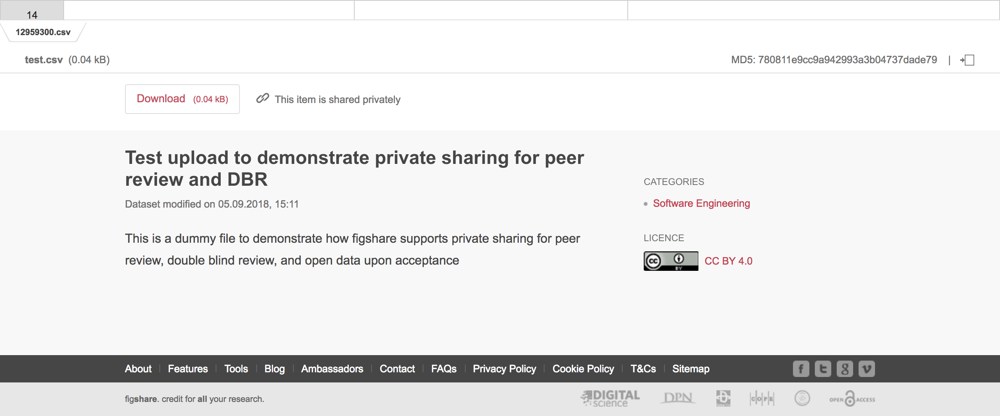
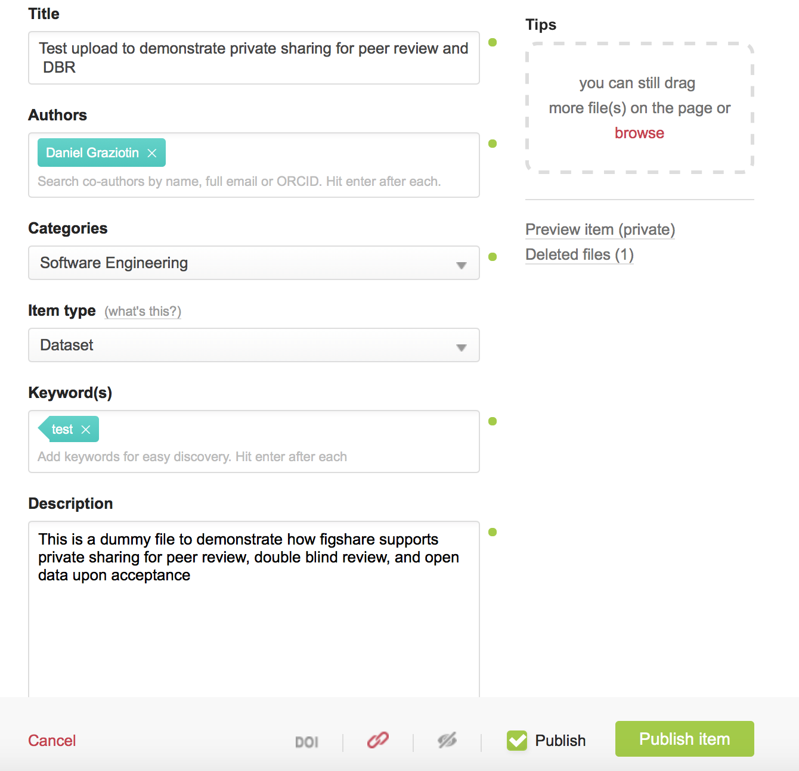
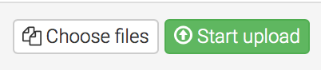
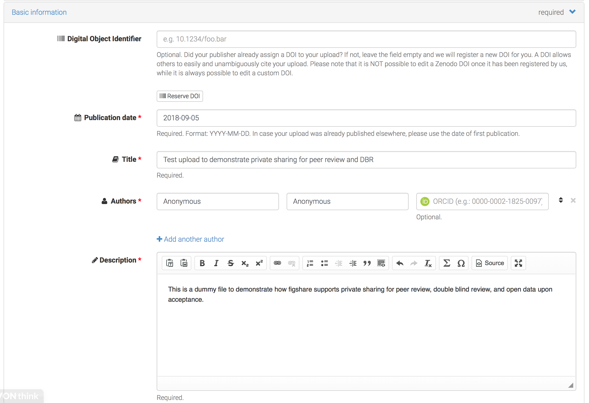
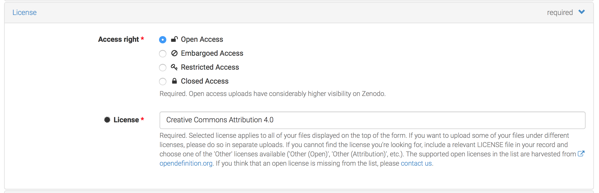
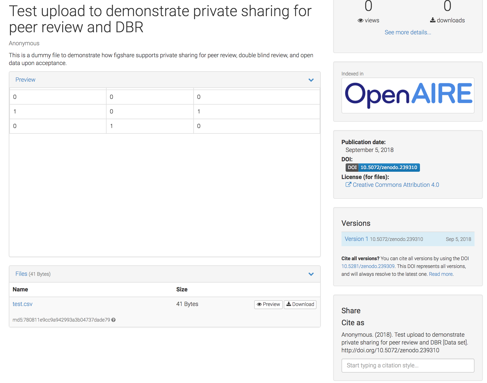

# How to disclose data for double-blind review and make it archived open data upon acceptance

> Daniel Graziotin. (2024). dgraziotin/disclose-data-dbr-first-then-opendata Zenodo. https://zenodo.org/doi/10.5281/zenodo.10532047

Openness in science is key to fostering progress via transparency, reproducibility and replicability. While open access and open data are two fundamental pillars in open science, it is open data that builds the core for excellence in evidence-based research. This is why I have striven for years to bring open science practices, including open access and open data, to software engineering research.

Several venues in software engineering[^1] are adopting double-blind review as well as recommending to share data with reviewers and to produce open data upon acceptance[^2].

While I am working to turn that _recommending_ into a _demanding_ (we are getting there), several authors have approached me with the fear of doing the wrong thing when `double-blind review` and `data sharing` are occurring at the same time. Indeed, the process is simple but it is true that once data is properly open data and archived, there is no turning back[^3].

> With this post, I will describe how to make your dataset available for double-blind review and then released as properly licensed and archived[^4] open data with a flip of a switch.[^5]

Quick jump:

- [Instructions for figshare](#double-blind-data-submission-on-figshare).
- [Instructions for Zenodo](#double-blind-data-submission-on-zenodo).

First, I want to repeat for the _nth_ time: **please, do not serve preprints, postprints, and datasets, from non-persistent systems such as your personal website--being it on your personal server or your institution's server--or consumer cloud storage (e.g., Dropbox, Google Drive)**. All these systems are _really_ volatile, and data will eventually disappear over sometimes short periods of time[^6].

Science and research need your produced knowledge in perpetuity--and yes, any of your produced knowledge is precious to us. This is why your data (and pre/postprints) should be released under a proper license and stay in archived repositories where nobody, not even you, can delete it.

Enter [figshare.com](https://figshare.com)[^7] and [Zenodo.org](https://zenodo.org). Figshare and Zenodo are two disciplinary-agnostic platforms for archived open data. Both provide the same functionality. The former is for profit but run by open science activists, the latter is not-for profit and backed by OpenAIRE and CERN. Both are free to use for users. Both provide the same functionalities. Figshare content is archived and distributed with CLOKSS. Zenodo, as far as I know, does not use any further digital preservation and archival system but it is hosted at CERN, which brings fair confidence on their data preservation abilities.

Alright, let's do this. I will first describe the steps for figshare and then for Zenodo. I am assuming that you already have:

 	
  * an anonymized dataset which is ready to be seen by third-party people _as well as machines_.

 	
  * an account on either figshare or Zenodo. You do not need an anonymous/dummy account.

I have created a dummy dataset named _test.csv_ that I will use for both figshare and Zenodo.

## Double-blind data submission on figshare

Once you start a submission in figshare, you need to fill in details such as title, authors, submission categories, item type, keywords, and description.

You can provide unblinded author details here already. _Author details be blinded once the item is published for double-blind review_. **Make sure that title and description are blinded.** These fields _will_ become visible instead.

Here comes the important part. Be sure to `Generate a private link` and **do not flag the `Publish` option**. The following screenshot shows the correct flags already.

There is no need to flag the options `Apply embargo`, `Make file(s) confidential`[^8] , and `Reserve Digital Object Identifier`.

After you double-check that the `Publish` is _not_ flagged, you can save the item.

Include the private URL on your submission. In my case, the private URL was `_https://figshare.com/s/9cfe7e5d1d07140ff285_`.

This is what reviewers see when they access your dataset from the private URL:

The dataset is nicely previewed and can be downloaded. Title, category, and description are shown. Author details and your username are not shown. You are all set. The dataset is private to you and to those who are aware of private URL. The dataset is not indexed by figshare.

**Important: private URLs at figshare expire after 12 months** and can be extended by contacting support. This is on purpose to avoid using private URLs as final placeholders.

## Open data upon acceptance on figshare

Congratulations for getting your paper accepted. There are now only three steps required to make your figshare submission open data.

 	
  1. Pick either the [CC0](https://creativecommons.org/publicdomain/zero/1.0/) or the [CC-BY 4.0](https://creativecommons.org/licenses/by/4.0/) license. The former is equivalent to make the data public domain (cannot bee more free than this). The latter requires attribution when re-using the data and allows any kind of reuse[^9]. Please note that former versions of the CC-BY license are not properly worded for data.

 	
  2. Flag the `Publish` option.

 	
  3. Use the DOI you have just received to properly reference your open data in your paper.

Here is my now published test file:

    
    Graziotin, Daniel (2018): Test upload to demonstrate private sharing for peer review and DBR. figshare. Dataset. DOI: <a href="https://doi.org/10.6084/m9.figshare.7048631.v1">10.6084/m9.figshare.7048631.v1</a>.

Done. **You are now an open science hero and my personal hero**.

## Double-blind data submission on Zenodo

Zenodo also allows submissions of blinded data, but I find the process less intuitive and with a twist. As far as I know, the only way to make a submission double-blind compliant is to effectively publish the submission as open access [sic] and blind all details. Other options will either make the file not available (`Embargo access` or `Closed access` options) or reveal your username in the request process (`Restricted access` option).

**Important: your dataset will be anonymous and double-blind compliant. However, the file will be publicly accessible and indexed in Zenodo.**

First, upload your dataset. Make sure to click the green `Start upload` button after you have chosen your dataset.

Fill in the various details but make sure to never reveal identifying information. The following part differs from figshare approach: write _Anonymous_ for the `author first and last name`. You are using your account for uploading the item, but the published data will show _Anonymous_ as author and your username will not be revealed.

Pick the [CC-BY 4.0](https://creativecommons.org/licenses/by/4.0/) license. CC-BY requires attribution when re-using the data and allows any kind of reuse[^9].

As explained above, select _Open Access_ as `access right`.

Save and then publish the dataset. Use the obtained DOI to reference the dataset in your double-blind submission.

This is what reviewers will see:

## Open data upon acceptance on Zenodo

Congratulations for getting your paper accepted. There are only two steps required to make your Zenodo submission open data. Actually, it was open data already. You need to unblind it now.

 	
  1. Fill in the actual author details instead of the _Anonymous_ entry.

 	
  2. Use the DOI to properly reference your open data in your paper.

That was it. Feel free to [contact me](/contact) in case of questions or leave a comment below. Especially if I missed something with Zenodo.

---

[^1]: This post is aimed to the software engineering research community, but it actually works with any discipline.
[^2]: I have so far worked with [CHASE](http://www.chaseresearch.org/workshops/chase2016), [MSR](http://2017.msrconf.org/#/home), [PROFES](https://profes2017.q-e.at/open-science-practices/), [ESEM](http://eseiw2018.wixsite.com/esem2018/open-science-policy), and ESEC/FSE [to be defined] on open science policies as well as serving as open science chair on all of them but MSR. Fun trivia: the [CHASE workshop](http://www.chaseresearch.org) has been the first software engineering venue to implement open science policies, in 2016. While I am at it, I would like to deeply thank [Daniel Méndez](http://www.mendezfe.org) for his support and his attempts to introduce open science practices in conferences and involving me on the matter.
[^3]: Both figshare and Zenodo are versioned. Each time you save a _published_ submission, a new version is created and also published. There is no easy way to un-publish a submission and its versions. Be careful.
[^4]: Archived means that there are mechanisms in place to make sure that data is properly preserved, duplicated, and distributed in a way that it will survive even the hosting platform. See for example [LOCKKS and CLOKKS](https://en.m.wikipedia.org/wiki/LOCKSS).
[^5]: The approach is also compatible with single blind review and open peer review.
[^6]: This has been empirically demonstrated [[1](https://doi.org/10.1002/asi.10018)], [[2](http://www.informationr.net/ir/9-2/paper174.html)].
[^7]: _Edit 2019-09-26: As of September I am no longer advisor at any company including figshare._ ~~Full disclosure: I am a figshare advisor. If you ask me which one should you pick between figshare and Zenodo, my answer will be biased.~~
[^8]: Make file(s) confidential is an option for when only metadata should be made publicly available. In software engineering research, we are likely to never use it.
[^9]: Some have asked me why not opting for the [CC BY-NC 4.0](https://creativecommons.org/licenses/by-nc/4.0/), which does not allow commercial use of your data. Here is why [[1](https://zenodo.org/record/840652)].

